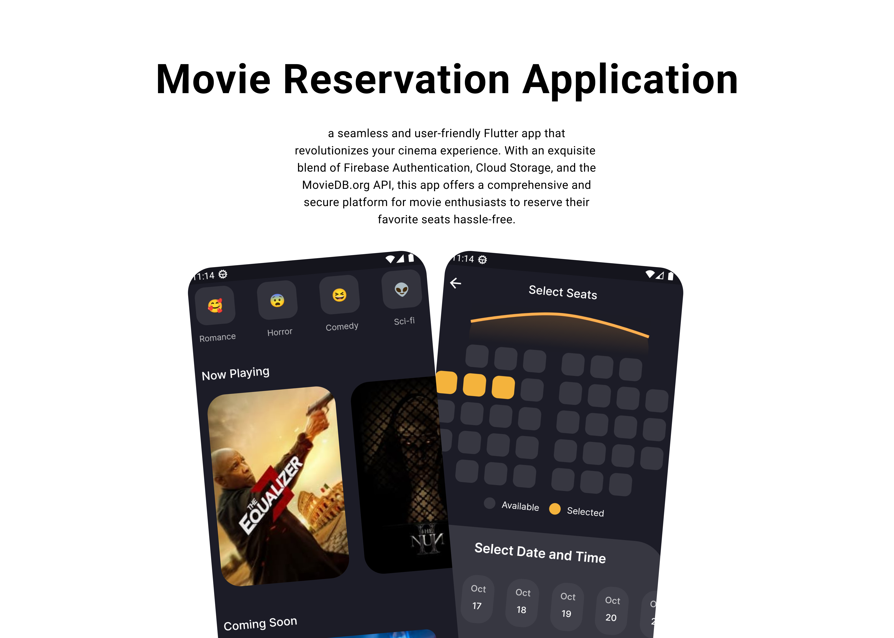
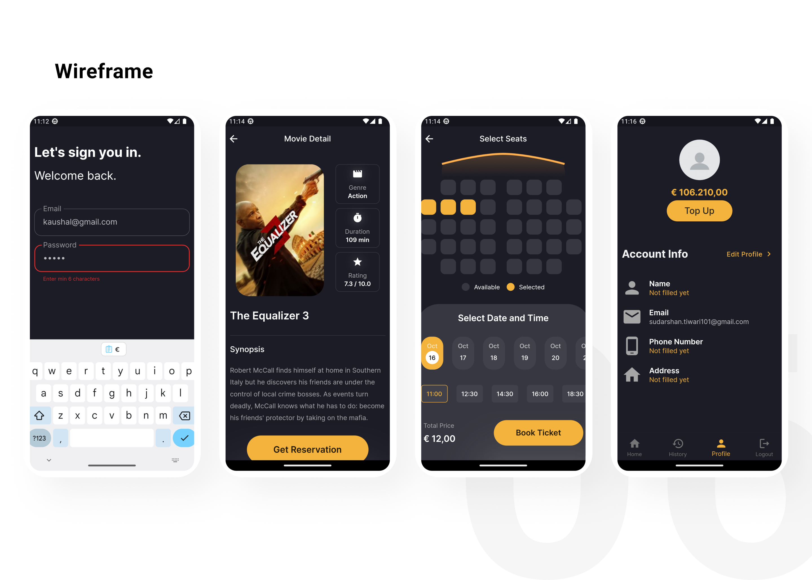

## Movie_Reservation_App

This repository contains the source code for a movie reservation application, designed to streamline the process of booking and managing movie tickets. The application provides users with a user-friendly interface to browse available movies, select showtimes, and reserve seats for their preferred screenings.

## Getting Started

Explore the code, contribute, and run the application locally. Follow our Getting Started Guide for a quick setup.

## Features
1. User Authentication: 
        Secure user registration and authentication system to ensure the privacy and security of user accounts.
2. Movie Listings: 
        Display a comprehensive list of available movies, complete with details such as title, genre, rating, and synopsis.
3. Showtimes and Seats: 
        Users can view showtimes for each movie and choose their preferred seats from an interactive seating chart.
4. Reservation Management: 
        Users can easily manage their reservations, including viewing, modifying, or canceling existing bookings.
5. Payment Integration: 
        Integration with a secure payment gateway to facilitate online transactions for ticket reservations.

## ScreenShots 

